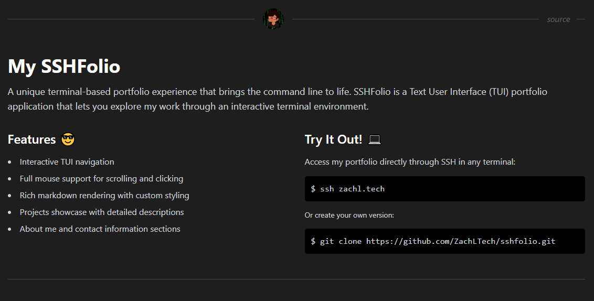

# SSHfolio Web Demo

A web-based interactive demo of my SSHfolio terminal portfolio, allowing users to experience the SSH portfolio interface directly in their browser. This demo provides a seamless way to preview the SSHfolio terminal user interface without requiring SSH access.



## Overview 🚀

This web demo serves as a companion to my main [SSHfolio](https://github.com/ZachLTech/sshfolio) project, providing an accessible way to showcase my terminal-based portfolio. It features a real-time terminal emulator that connects to the actual SSHfolio instance, allowing users to interact with the portfolio system directly from their web browser.

## Features ✨

- **Live Terminal Emulation**: Real-time terminal experience using Xterm.js
- **WebSocket Integration**: Direct connection to SSHfolio instance via secure WebSocket proxy
- **Responsive Design**: Fully responsive terminal interface that adapts to different screen sizes
- **Interactive UI**: Connect/disconnect functionality with status indicators
- **Native Terminal Experience**: Full support for terminal colors, formatting, and interactions
- **Docker Support**: Fully containerized deployment with Docker Compose

## Tech Stack 🛠️

- **Frontend**:
  - Xterm.js for terminal emulation
  - TailwindCSS for styling
  - Vanilla JavaScript for interactions
  
- **Backend**:
  - Node.js WebSocket proxy
  - SSH2 for secure shell connections
  - WebSocket server for real-time communication

- **Infrastructure**:
  - Docker & Docker Compose
  - Node.js Alpine containers
  - Bridge networking

## Quick Start with Docker 🐳

1. **Clone the Repository**
   ```bash
   git clone https://github.com/ZachLTech/sshfolio
   cd sshfolio
   git checkout demo
   ```

2. **Launch the Application**
   ```bash
   docker-compose up
   ```

3. **Access the Demo**
   Open `http://localhost:3000` in your browser

## Live Demo 🎮

Experience the live demo at: [https://sshfolio.zachl.tech](https://sshfolio.zachl.tech)

Or try the actual SSH portfolio:
```bash
ssh zachl.tech
```

## Contributing 🤝

1. Fork the repository
2. Create your feature branch: `git checkout -b feature/awesome-feature`
3. Commit your changes: `git commit -m 'Add awesome feature'`
4. Push to the branch: `git push origin feature/awesome-feature`
5. Submit a pull request

## License 📄

This project is licensed under the MIT License - see the [LICENSE](LICENSE) file for details.